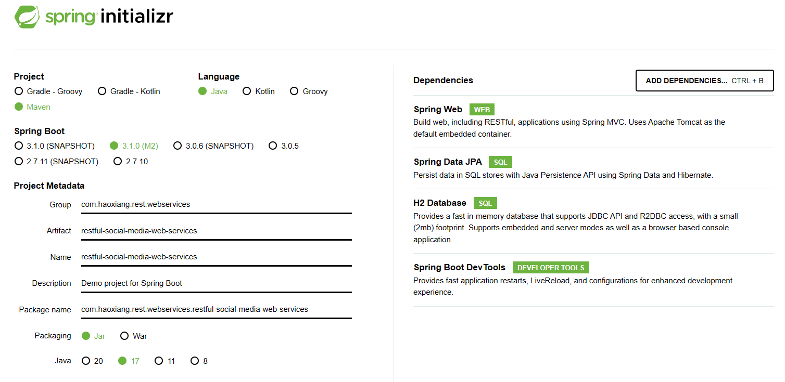

# Social Media Web Service Using RESTful

The project using the Spring Framework using [https://start.spring.io](https://start.spring.io) with the configurations
showing below:

### Details
* Project: Maven
* Language: Java 17
* Spring Boot: 3.1.0(M2)

#### Dependencies
* Spring Web
* Spring Data JPA
* H2 Database
* Spring Boot Dev Tools
---

## Social Media Application REST API

Key Resources:
* Users
* Posts

Key Details
* User: id, name, birthDate
* Post: id, description

### Request Methods for REST API
* **GET** - Retrieve details of a resource
* **POST** - Create a new resource
* **PUT** - Update an existing resource
* **PATCH** - Update part of a resource
* **DELETE** - Delete a resource